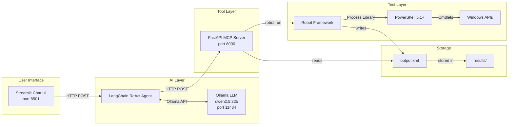
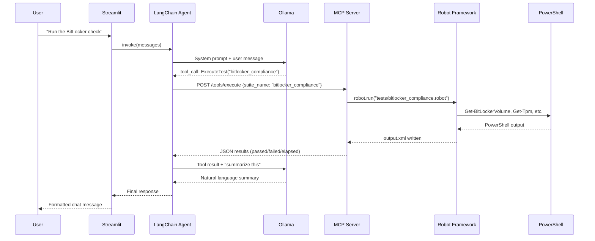

# Architecture

Technical architecture documentation for the Robot Framework AI Agent.

## 1. System Overview

### High-Level Architecture



### Component Responsibilities

| Component | Responsibility |
|-----------|---------------|
| **Streamlit UI** | Chat interface, session management, service health display |
| **LangChain Agent** | Natural language understanding, tool selection, response generation |
| **Ollama LLM** | Token generation, tool-call decisions, natural language output |
| **MCP Server** | HTTP API wrapper, test execution orchestration, result parsing |
| **Robot Framework** | Test execution engine, keyword-driven test definition |
| **PowerShell** | Windows system inspection (registry, services, BitLocker, TPM) |

### Data Flow



## 2. Component Details

### Streamlit UI (`ui/app.py`)

**Purpose:** Browser-based chat interface for non-technical users.

**Key design decisions:**
- `st.chat_message` for native chat bubbles
- `st.session_state` for conversation persistence across reruns
- `@st.cache_resource` to initialize the agent once
- `sys.path` manipulation to import from project root
- Example prompt buttons use `pending_prompt` pattern to trigger agent on rerun

**Service health checks:** On every page load, the UI pings both the MCP server (`/health`) and Ollama (`/api/tags`) to show green/red status indicators in the sidebar.

### LangChain Agent (`agent/agent.py`)

**Purpose:** Orchestrates tool calls using the ReAct (Reasoning + Acting) pattern.

**Agent type:** `create_agent` from LangChain 1.2+ which produces a compiled LangGraph.

**Tool selection:** The LLM receives a system prompt describing the available tools and their purposes. Based on the user's question, it generates a structured `tool_call` JSON specifying which tool to invoke and with what arguments. After receiving the tool's response, the LLM generates a human-readable summary.

**Tools registered:**

| Tool | Description | MCP Endpoint |
|------|-------------|-------------|
| `ListTests` | Discover available test suites | `POST /tools/list_tests` |
| `ExecuteTest` | Run a suite by name | `POST /tools/execute` |
| `GetResults` | Retrieve previous results | `POST /tools/results` |
| `SearchLogs` | Search log messages | `POST /tools/search_logs` |

**Communication:** Tools call the MCP server over HTTP using `requests.post()`. Errors are returned as strings (not exceptions) so the agent can report them conversationally.

### MCP Server (`mcp_server/`)

**Purpose:** Exposes Robot Framework operations as HTTP-callable tools.

**Two layers:**
1. `tools.py` — Core tool implementations using `FastMCP`. Each tool is a Python function that calls `robot.run()` or parses `output.xml`.
2. `server.py` — FastAPI wrapper that translates HTTP requests into tool calls and returns JSON responses.

**Why two layers?** The `FastMCP` tools can also run over stdio (standard MCP protocol) for direct integration with MCP-compatible clients. The FastAPI server adds HTTP accessibility for the LangChain agent.

**Key implementation details:**
- `robot.run()` is called with `outputdir=results/<suite_name>/` to keep results organized
- `ExecutionResult` from `robot.api` parses `output.xml` into a structured result object
- `search_test_logs` uses `xml.etree.ElementTree` to find `<msg>` elements and builds a parent map to determine which test each message belongs to
- `_extract_suite_doc()` parses `.robot` files to extract the `Documentation` setting (handling `...` continuation lines)

### Robot Framework Tests (`tests/`)

**Test structure:** Each `.robot` file follows a consistent pattern:

```
*** Settings ***     — Libraries, suite setup/teardown
*** Variables ***    — PowerShell path, configuration values
*** Keywords ***     — Reusable "Run PowerShell Command" keyword
*** Test Cases ***   — Individual compliance checks
```

**PowerShell execution pattern:**
```robot
Run PowerShell Command
    [Arguments]    ${command}    ${fail_msg}=PowerShell command failed
    ${result}=    Run Process    ${POWERSHELL}
    ...    -NoProfile    -NonInteractive    -Command    ${command}
```

Each argument is passed separately to `Run Process` (not as a single concatenated string) to avoid shell interpretation issues.

**Test suites:**

| Suite | Tests | What it checks |
|-------|-------|----------------|
| `bitlocker_compliance` | 5 | BitLocker status, encryption method, volume encryption, TPM, Secure Boot |
| `application_deployment` | 4 | Office, Adobe Acrobat, 7-Zip, Chrome via registry |
| `windows_services` | 6 | Defender, Windows Update, DNS Client, Firewall, W32Time, summary |

## 3. Technology Stack

| Technology | Version | Purpose | Why chosen |
|------------|---------|---------|-----------|
| Python | 3.10+ | Runtime | Ecosystem support for all components |
| Robot Framework | 7.4+ | Test execution | Industry-standard keyword-driven testing |
| LangChain | 1.2+ | Agent framework | Mature ReAct implementation, tool binding |
| langchain-ollama | 1.0+ | LLM integration | Official Ollama integration for LangChain |
| Ollama | Latest | Local LLM runtime | Simple local deployment, no API keys |
| Qwen 2.5 32B | Q4_K_M | Language model | Strong tool-calling, runs on consumer hardware |
| FastAPI | 0.104+ | HTTP server | Async, auto-docs, Pydantic validation |
| Streamlit | 1.31+ | Chat UI | Rapid prototyping, native chat components |
| FastMCP | 0.9+ | MCP protocol | Standard tool protocol, stdio + HTTP |
| Pydantic | 2.5+ | Data validation | Request/response schemas for FastAPI |
| uvicorn | 0.24+ | ASGI server | Production-grade async HTTP server |

### Alternatives Considered

| Decision | Chosen | Alternative | Rationale |
|----------|--------|-------------|-----------|
| LLM runtime | Ollama | vLLM, llama.cpp | Ollama has simpler setup, built-in model management |
| Agent framework | LangChain | CrewAI, AutoGen | Most mature tool-calling support, large ecosystem |
| UI framework | Streamlit | Gradio, React | Native chat components, rapid iteration |
| HTTP framework | FastAPI | Flask, Django | Async support, automatic OpenAPI docs |
| Test framework | Robot Framework | pytest | Keyword-driven approach better for compliance checks |

## 4. Design Decisions

### Local-first architecture

All components run on the local machine. No data is sent to external services. This is critical for compliance testing where system information (encryption status, installed software, service configuration) is sensitive.

### ReAct agent pattern

The agent follows a Reason-Act cycle: it receives the user's question, reasons about which tool to call, acts by calling the tool, observes the result, and then reasons again to produce a response. This pattern naturally handles multi-step workflows (e.g., list tests, then execute one, then search logs for failures).

### MCP over direct integration

Rather than having the agent call `robot.run()` directly, we use MCP as an intermediary. Benefits:
- **Separation of concerns** — the agent doesn't need to know Robot Framework internals
- **Reusability** — the MCP tools can be used by other clients (CLI, other agents)
- **Testability** — the HTTP API can be tested independently with curl or Swagger
- **Standard protocol** — MCP is an emerging standard for AI tool integration

### Test suite selection

The three included test suites cover common Windows endpoint compliance areas:
- **BitLocker** — data-at-rest encryption (regulatory requirement)
- **Application deployment** — software inventory verification
- **Windows services** — critical service health monitoring

These demonstrate the pattern; additional suites can be added by dropping `.robot` files into the `tests/` directory.

## 5. Scalability Considerations

### Adding more tests

1. Create a new `.robot` file in `tests/`
2. The `list_available_tests` tool auto-discovers it by scanning the directory
3. No code changes required in the MCP server or agent

### Distributing test execution

The current architecture runs tests locally. To scale to multiple endpoints:
- Deploy the MCP server + Robot Framework on each endpoint
- Add a central orchestrator that calls each endpoint's MCP server
- Aggregate results centrally

### Handling large fleets

For enterprise scale:
- Replace local MCP server calls with a message queue (e.g., RabbitMQ)
- Store results in a database instead of local XML files
- Add a dashboard for fleet-wide compliance reporting
- Use Robot Framework's `pabot` for parallel test execution

## 6. Security Considerations

### Local execution only

- All LLM inference happens on-device via Ollama
- The MCP server binds to `127.0.0.1` (localhost only, not network-accessible)
- No API keys, tokens, or credentials are stored or transmitted

### PowerShell execution safety

- Robot Framework's `Run Process` executes PowerShell with `-NoProfile -NonInteractive`
- Commands are read-only queries (`Get-BitLockerVolume`, `Get-Service`, registry reads)
- No commands modify system state
- `shell=True` is NOT used — arguments are passed as separate tokens to prevent injection

### Log handling

- Test results are stored in `results/<suite_name>/output.xml`
- These files contain system information (service names, encryption status)
- The `results/` directory is gitignored to prevent accidental commits
- No credentials or secrets appear in test output

### CORS configuration

The FastAPI server restricts CORS origins to localhost ports only:
- `http://localhost:8501` (Streamlit)
- `http://localhost:3000` (development)
